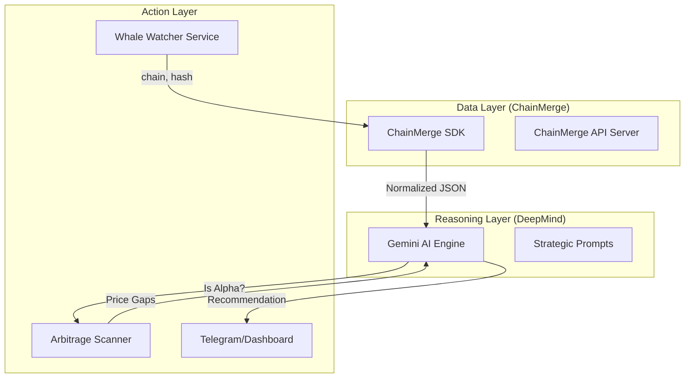

# Alpha Nexus: The AI Multichain Profit Agent

Alpha Nexus is a high-performance intelligence agent that combines **Whale Tracking (Alpha)** with **Cross-Chain Arbitrage (Profit)**, powered by the **ChainMerge SDK** and **Google DeepMind (Gemini)**.

## 🚀 The Vision
Alpha Nexus doesn't just find price gaps; it finds "Signal-Backed" opportunities. It follows the world's best traders (Whales) across 8 blockchains and identifies where the market hasn't yet reacted to their moves.

---

## 🏗 System Architecture



---

## 🛠 Project Structure (Standalone)

You should initialize this in a new folder:

```text
alpha-nexus/
├── src/
│   ├── index.ts          # Entry point
│   ├── client.ts         # ChainMerge SDK instance
│   ├── whale_watcher.ts  # Logic to monitor big transfers
│   ├── ai_engine.ts      # Gemini integration & prompting
│   ├── arb_scanner.ts    # Cross-chain price comparison
│   └── types.ts          # Shared interfaces
├── .env                  # API Keys (CHAINMERGE_KEY, GEMINI_KEY)
├── package.json
└── tsconfig.json
```

---

## 📝 Implementation Blueprint

### Phase 1: The "Pulse" (Data Ingestion)
1. **Bootstrap**: Install `chainmerge-sdk` (NPM).
2. **Watcher**: Use `client.listRecentIndexedTxs()` to scan for transactions where `Action.amount` > $100,000 USD.
3. **Storage**: Filter unique "Whale" addresses and track their last 24h activity.

### Phase 2: The "Brain" (Gemini Integration)
1. **Context**: Pass the whale's recent `NormalizedTransaction[]` list to Gemini.
2. **Reasoning**: Ask Gemini: *"Is this move typical for this address? Does this token have liquidity on other chains we decode?"*
3. **Signal**: Output a confidence score from 1-100.

### Phase 3: The "Profit" (Arbitrage Routing)
1. **Scan**: If Gemini gives a high signal (>80), use the SDK to check the same `token_address` on the other 7 supported chains.
2. **Math**: `(Target_Price - Source_Price) - (Gas + Bridge_Fees) = Net_Profit`.
3. **Alert**: Trigger an alert with the "One-Click Trade" link.

---

## 🔑 Environment Variables
Create a `.env` file in your new folder:
```bash
CHAINMERGE_BASE_URL="http://your-api-url"
CHAINMERGE_API_KEY="your-key"
GEMINI_API_KEY="your-google-cloud-key"
WHALE_THRESHOLD_USD="100000"
```

---

## 💡 Why this works
- **Speed**: ChainMerge decodes 8 chains instantly.
- **Context**: Gemini understands *intent*, not just numbers.
- **Reach**: You can track a Solana whale and arbitrage them on Starknet or Aptos automatically.
