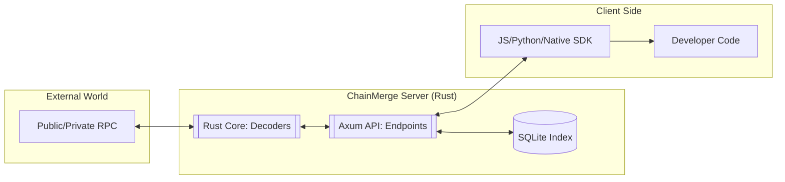

# ChainMerge Architecture: Rust-to-SDK Pipeline

This document provides a comprehensive technical specification of how ChainMerge decodes, normalizes, and delivers multichain transaction data. It covers everything from the low-level **Rust Core** to the high-level **SDK** interfaces.

## 1. Architectural Foundations

ChainMerge is built as a **Single Source of Truth** system. All decoding logic lives in Rust, ensuring that every SDK (TypeScript, Python, Go, etc.) returns identical results for the same transaction.

### The 3-Tier Execution Flow

---

## 2. Inbound Data Specification (What the SDK Takes)

When a developer calls `client.decodeTx()`, the following data flows into the system:

### A. Authentication & Headers
- **`x-api-key`**: (Optional) String used for rate-limiting and access control.
- **`accept`**: Expected to be `application/json`.

### B. Request Parameters (Query String)
| Parameter | Type | Validation Rules | Description |
|:--- |:--- |:--- |:--- |
| `chain` | `String` | Must match supported list (enum). | The target blockchain (e.g., `solana`, `ethereum`). |
| `hash` | `String` | Length and format check per chain. | The unique transaction identifier. |
| `rpc_url` | `String` | Optional. Must be valid URL. | Overrides the default backend RPC node. |

### C. Validation Logic (Rust Layer)
Before any network call, the Rust Core validates the `hash` format:
- **Ethereum/Starknet**: Starts with `0x`, 66 chars (hex).
- **Bitcoin**: 64 chars (hex).
- **Solana/Sui/Aptos**: Base58/Base64 strings (32–128 chars).

---

## 3. The Core Processing Pipeline

Once the data is validated, the Rust Core performs the following steps:

1.  **RPC Fetching**: Connects to the chain provider using the selected `rpc_url`. It handles retry logic for transient network failures.
2.  **Raw Decoding**: Parses the binary response (ABIs for EVM, Borsh for Solana, BCS for Sui/Aptos).
3.  **Normalization**: Maps chain-specific logs into the **Universal Event Model**.
4.  **Semantic Lifting**: Aggregates multiple events into a single "Action." 
    - *Example*: An EVM "Approval" + "Transfer" + "Burn" is lifted into a single **Swap** action.
5.  **Persistence**: The result is serialized to JSON and stored in the SQLite Index for instant future retrieval.

---

## 4. Outbound Data Specification (What the SDK Returns)

The SDK returns a `NormalizedTransaction` object. This object is the result of converting the Rust `struct` into JSON, and then into a language-native class/interface.

### A. Header Metadata
- `chain`: The origin blockchain.
- `tx_hash`: Canonical transaction identifier.
- `sender`/`receiver`: Top-level addresses derived from the main transaction intent.
- `value`: Native currency amount (e.g., ETH, SOL) in human-readable decimal string.

### B. Events (Granular)
 Granular, log-level triggers.
- `event_type`: `token_transfer`, `nft_mint`, `contract_interaction`, etc.
- `token`: Contract address or mint ID.
- `from`/`to`: Transfer parties.
- `amount`: Raw value moved.

### C. Actions (High-Level Intent)
The most valuable part of the SDK for developers. It tells you **what happened** without requiring blockchain expertise.
- `action_type`: `transfer`, `swap`, `stake`, `bridge`, `unknown`.
- `metadata`: A flexible JSON blob containing action-specific context (e.g., swap routes, pool IDs).

---

## 5. Error Data Model

ChainMerge uses a canonical error format so SDKs can handle failures predictably.

| Rust `ErrorCode` | SDK Exception | HTTP Status | Description |
|:--- |:--- |:--- |:--- |
| `unsupported_chain` | `UnsupportedChainError` | 400 | Chain is not supported by this version. |
| `invalid_request` | `ValidationError` | 400 | Missing or malformed parameters. |
| `invalid_hash` | `InvalidHashError` | 422 | Hash length or format is incorrect. |
| `rpc` | `ChainTransportError` | 502 | Target blockchain RPC is down or timed out. |
| `internal` | `InternalServerError` | 500 | Unexpected error in decoding logic. |

---

## 6. Cross-Language Mapping Reference

| Concept | Rust Struct | TypeScript Interface | Python Dataclass |
|:--- |:--- |:--- |:--- |
| **Transaction** | `NormalizedTransaction` | `NormalizedTransaction` | `NormalizedTransaction` |
| **Event** | `NormalizedEvent` | `NormalizedEvent` | `NormalizedEvent` |
| **Action** | `Action` | `Action` | `Action` |
| **Error** | `ErrorEnvelope` | `ErrorEnvelope` | `ChainMergeAPIError` |

---

## 7. Performance & Optimization Tips

- **Use the Index**: Calling `client.lookupIndexedTx()` is 100x faster than `decodeTx()` because it skips the network call to the blockchain RPC.
- **Batching**: While the API is 1:1, use the SDK effectively by calling multiple `decodeTx()` promises in parallel (`Promise.all` in JS, `asyncio.gather` in Python).
- **Custom RPCs**: For high-traffic apps, always provide your own `rpc_url` to bypass public rate limits.
