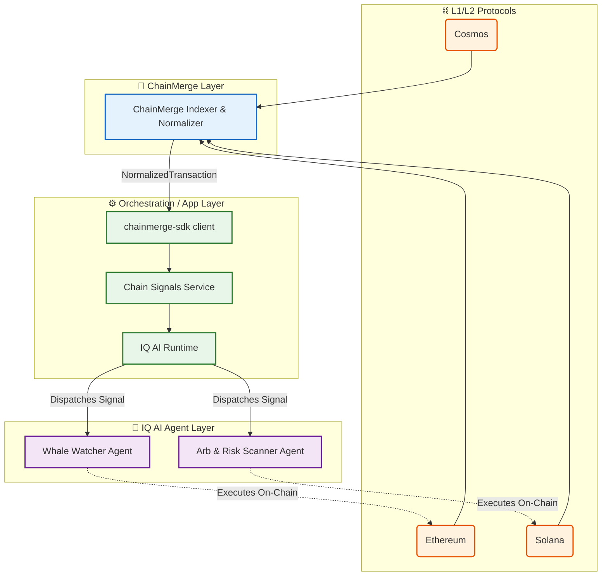
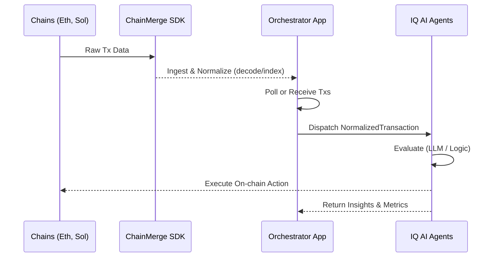

# 🧩 IQ AI × ChainMerge Integration Plan
> **A Comprehensive Design Document & Architectural Blueprint**
> Integrating autonomous IQ AI agents into the ChainMerge multichain ecosystem.

---

## 🏗️ 1. High‑Level Architecture

The architecture seamlessly bridges raw multichain data with intelligent, autonomous AI execution. The integration is divided into three core layers:

1. **ChainMerge (Signal Layer)** 📡
   - Normalizes raw multichain data into a unified `NormalizedTransaction` JSON schema.
   - Triggers semantic events like `token_transfer`, `nft_mint`, or `swap`.
   
2. **IQ AI (Agent / Action Layer)** 🤖
   - Hosts autonomous, tokenized DeFAI agents.
   - Encapsulates trading strategies, risk assessments, and on‑chain execution capabilities.

3. **Orchestration / App Layer** ⚙️
   - Utilizes `chainmerge-sdk` to process and fetch normalized data.
   - Forwards `NormalizedTransaction` payloads securely to IQ AI agents.
   - Surfaces real-time insights to users via interactive UIs, logs, and APIs.

### 🗺️ Visual Mental Model



---

## 📦 2. Data Model (The IQ AI Payload)

The data flowing into IQ AI must be deterministic and accurately typed. Below are the key types utilized from `chainmerge-sdk` that act as the **core payload**:

```typescript
type Chain =
  | "solana"
  | "ethereum"
  | "cosmos"
  | "aptos"
  | "sui"
  | "polkadot"
  | "bitcoin"
  | "starknet";

interface NormalizedEvent {
  event_type: "token_transfer" | "unsupported";
  token?: string;
  from?: string;
  to?: string;
  amount?: string;
  raw_program?: string;
}

interface NormalizedTransaction {
  chain: Chain;
  tx_hash: string;
  sender?: string;
  receiver?: string;
  value?: string;
  events: NormalizedEvent[];
}
```

> **Note**: This `NormalizedTransaction` object is the definitive input boundary for all IQ AI agents.

---

## 🚀 3. Integration Flow (Step‑by‑Step)



1. **Ingest & Normalize** 📥 
   - Initialized via `ChainMergeClient` from `chainmerge-sdk` to decode or index transactions using operations such as `decodeTx()`, `decodeAndIndexTx()`, and `listRecentIndexedTxs()`.
2. **Dispatch to Agents** 📨 
   - The Orchestration layer (via a `chainSignals` module) funnels the unified `NormalizedTransaction` objects to subscribed agents based on logic patterns (e.g., chain ID, token addresses).
3. **Decide & Act** 🧠 
   - IQ AI agents ingest the uniform data. Optional deterministic LLM reasoning can evaluate risk arrays before executing on-chain functions (e.g., hedging or MEV arbs).
4. **Observe & Iterate** 🔄 
   - Feedback loops update agent behavior leveraging execution metrics while ChainMerge perpetually provides indexing signals.

---

## 📂 4. Concrete Modules To Add

### 🔗 4.1 Shared ChainMerge Client
**Goal**: A globally accessible API wrapper.  
**File**: `src/lib/chainmergeClient.ts`  
- Configure credentials (`CHAINMERGE_BASE_URL`, `CHAINMERGE_API_KEY`).
- Export a singleton wrapper (e.g., `chainmergeClient`).

### 📡 4.2 Chain Signals Service
**Goal**: Subscriptions and transaction streaming.  
**File**: `src/services/chainSignals.ts`  
- Actively poll `listRecentIndexedTxs` or receive push events.
- Translate updates directly to `iqAgentRuntime.dispatchNormalizedTransaction(tx)`.

### 🎛️ 4.3 IQ AI Agent Runtime
**Goal**: Agent registry and signal fanning.  
**File**: `src/agents/iq/runtime.ts`  
- Implement `IqAgent.handleNormalizedTransaction(tx: NormalizedTransaction)`.
- Manage agent lifecycles (Watchers, Arbitrageurs, Risk Assessors).
- Route signals uniformly across all active bots.

---

## 🐋 5. First Agent: Whale Watcher & Arb Scout

### Concepts & Goals
- **Objective**: Identify massive `token_transfer` events mapping to major stablecoin thresholds.
- **Phase 1**: Passive logging & strategy evaluation testing.
- **Phase 2**: Autonomous execution via IQ AI ADK.

### Example Implementation

```typescript
import type { NormalizedTransaction } from "chainmerge-sdk";

export async function onNormalizedTransaction(tx: NormalizedTransaction) {
  for (const ev of tx.events) {
    if (ev.event_type !== "token_transfer") continue;

    // Monitor for thresholds over 1M USDC
    const size = BigInt(ev.amount ?? "0");
    const isWhale = size > 1_000_000n * 10n ** 6n; 

    if (!isWhale) continue;

    // Phase 1: Logging & Diagnostics
    console.info("🚨 [WhaleWatcher] Massive Move Detected:", {
      chain: tx.chain,
      txHash: tx.tx_hash,
      token: ev.token,
      amount: ev.amount,
      route: `${ev.from} -> ${ev.to}`,
    });

    // Phase 2: Active Strategy Engine & Execution
    /*
    const decision = await strategyEngine.evaluate({ tx, ev });
    if (decision.type === "ARBITRAGE_OPPORTUNITY") {
      await iqAgent.executeArb(decision.plan);
    }
    */
  }
}
```

---

## 🖥️ 6. UI & Developer Experience

To foster trust and provide operational clarity, the frontend stack should feature:

- 📊 **Status Dashboard**: 
  - Real-time indexing rate, client health points, and agent uptime.
- 🔍 **Universal Tx Explorer**: 
  - Input `chain` + `hash` to view pristine JSON outputs via ChainMerge indexing.
  - Highlights specific semantic layers directly mapping IQ AI reasoning lines.
- 📝 **Agent Activity Feed**: 
  - A comprehensive timeline detailing agent actions, log strings (e.g., *"WhaleWatcher: potential arb detected on Ethereum"*), and realized un-realized balances.

---

## ✅ 7. Implementation Checklist

### Core Setup
- [ ] Establish `CHAINMERGE_BASE_URL` & API Keys in `.env`.

### Architecture Deployment
- [ ] Initialize `src/lib/chainmergeClient.ts`.
- [ ] Scaffold `src/services/chainSignals.ts` (polling mechanism).
- [ ] Architect `src/agents/iq/runtime.ts` logic hub.
- [ ] Develop & register the `WhaleWatcher` module natively.

### UX & Diagnostics
- [ ] Deploy the API Health endpoints.
- [ ] Build Agent Activity Dashboard UI components (Feed/Explorer).

---
> *Completion of this blueprint establishes a powerful multichain signal bridge between ChainMerge pipelines and IQ AI automated taskers—poised for endless decentralized strategy variations.*
